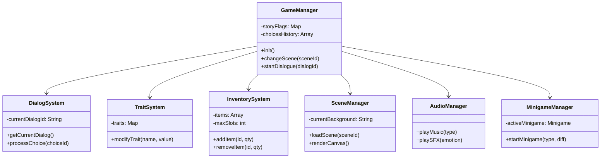

# 🌌 Cyberpunk Visual Novel - Story Progression Game

**Egy nyomasztó atmoszférájú webes játék**, amit a *Serial Experiments Lain* és *Cyberpunk 2077* esztétikája ihlet. Vizuális novella, ahol a te választásaid formálják a történet menetét.

---

## 📖 Sztorivázlat

A játék egy darkwave, cyberpunk hangulatú történetben játszódik, ahol különféle jellegzetességű karakterek közötti dialógusokkal haladsz előre a sztorin. A te választásaid azonban **trait módosítást** okoznak, amely befolyásolja a karaktered személyiségét és a megnyitható dialógus ágakat.

**Cél:** Végigjárni a sztorit, kezelni az inventoryt, és interaktív minigameken keresztül megoldani az akadályokat.

---

## 🎮 Játékmechanikák

### 1. 📢 **Dialógus Rendszer**

A dialógusok karakterekhez vannak rendelve (`mainCharacter`, `sibling`, `robot` stb.). Minden dialógusnak:
- Egy egyedi **ID** van
- Egy szöveg tartalom
- Opcionális választások lehetnek (választások nélküli dialógusok auto-advance-olnak)
- Trait módosítások (`traitMod`) a választások alapján
- Opcionális progresszió meghatározások (jelző beállítás, jelenet váltás)

A dialógusok az alábbi struktúrában vannak szervezve:
- `dialogs.js` – Karakterenként elválasztott dialógus sorozatok
- `DialogSystem.js` – Kezeli az adott dialógus lekéréseit és választásokat
- `DialogPanel.js` – Megjeleníti a dialógust és a lehetséges válaszokat

**Dialógus Áramlás:**
Egy dialógusból választás után az új karakter és az új dialógus ID alapján továbbmegyünk. Ha nincs választás, az `autoNext` objektum automatikusan továbblép a következő dialógusra.

---

### 2. 🧬 **Trait (Tulajdonság) Rendszer**

A karaktered **5 trait-je** van, melyek 0-100 között változnak. Ezek az alábbiak:
- **Empathy** (Empátia): Mennyire segítőkész vagy mások iránt
- **Aggression** (Agresszivitás): Milyen durván bánsz az emberekkel
- **Desperation** (Kétségbeesettség): Milyen erős a szükséghelyzet
- **Coldness** (Közömbösség): Mennyire vakmerő vagy szívtelen
- **Trust** (Bizalom): Mennyire bízol az emberekben

Ezek a trait-ek a `TraitSystem.js` osztályban vannak kezelve, és minden dialógus választás módosíthatja őket a `traitMod` objektumon keresztül.

---

### 3. 🕹️ **Minigame Rendszer**

A minigamek különálló játékmódok, amelyek a sztoriprogresszió közben aktiválódnak. Három típus létezik:
- **Lockpicking**: Zárak nyitása
- **Hacking**: Számítógépek feltörése
- **Puzzle**: Logikai feladvány

Minden minigamhez:
- Egy nehézségi szint van (1-5)
- Siker/kudarc utáni dialógus van definiálva
- Az `onSuccess` / `onFailure` objektumok megadják a következő sztorit

A `MinigameManager.js` kezeli az egész minigame rendszert, és az alábbi UI komponenseket használja:
- `HackingUI.js`
- `LockpickingUI.js`
- `PuzzleUI.js`

---

### 4. 🎒 **Inventory & Tárgyak Rendszer**

Az `InventorySystem.js` a játékos tárgyait kezeli. A tárgyak a `items.js`-ben vannak definiálva és a következő tulajdonságokkal rendelkeznek:
- **id**: Egyedi azonosító
- **name**: Tárgy neve
- **stackable**: Halmozható-e (igaz/hamis)
- **description**: Leírás
- **quantity**: Mennyiség (stackable tárgyaknál)

A játékos maximum 20 slottal rendelkezik, és tárgyakat fel/le tud venni a jelenetekben.

---

### 5. 📍 **Scene Management**

A `SceneManager.js` kezeli a jeleneteket (backgrounds, karakterek pozíciói, clickable elemek). Minden jelenetben:
- Egy háttérkép van
- Karakterek vannak pozicionálva és kattinthatóak
- Tárgyak lehetnek elhelyezve
- Minigamek indíthatók el a tárgyakból

Az `scenes.js` fájl tartalmazza az összes jelenet definícióját.

---

### 6. 🌙 **Audio Management**

Az `AudioManager.js` kezeli a zenelejátszást és hangeffekteket:
- **Zenék**: `dialogue`, `minigame`, `exploration` típusok
- **Hangeffektek**: Dialógus emóciók (`neutral`, `happy`, `angry` stb.)
- A musik és hangeffektek az `assets/music/` és `assets/sounds/` mappákban vannak

---

## 📁 Projekt Szerkezete

```
EvVegiCsoportMunka/
├── main.js                           # Főprogram belépési pont
├── package.json
├── README.md (ez a fájl)
├── test.html / test.js              # Teszt fájlok
│
├── modules/                         # Játék modulok
│   ├── GameManager.js               # Központi szálkezelő
│   ├── DialogSystem.js              # Dialógus logika
│   ├── SceneManager.js              # Jelenet kezelés
│   ├── InventorySystem.js           # Inventory kezelés
│   ├── AudioManager.js              # Zene és hangok
│   ├── TraitSystem.js               # Trait módosítások
│   ├── MinigameManager.js           # Minigamek vezérlése
│   ├── Minigame.js                  # Alap minigame osztály
│   ├── HackingGame.js               # Hacking minigame
│   ├── LockpickingGame.js           # Lockpicking minigame
│   ├── PuzzleGame.js                # Puzzle minigame
│   ├── Karakter.js                  # Karakter osztály
│   └── ...
│
├── ui/                              # UI komponensek
│   ├── DialogPanel.js               # Dialógus megjelenítése
│   ├── InventoryUI.js               # Inventory UI
│   ├── HackingUI.js                 # Hacking UI
│   ├── LockpickingUI.js             # Lockpicking UI
│   ├── PuzzleUI.js                  # Puzzle UI
│   ├── MinigameUI.js                # Általános minigame UI
│   ├── TraitDisplay.js              # Trait megjelenítés
│   ├── MainMenu.js                  # Főmenü
│   └── ...
│
├── data/                            # Adatfájlok
│   ├── dialogs.js                   # Dialógusok
│   ├── characters.js                # Karakterek
│   ├── items.js                     # Tárgyak
│   ├── scenes.js                    # Jelenetek
│   ├── minigames.js                 # Minigamek
│   ├── traits.js                    # Trait alapértékek
│   ├── storyFlow.js                 # Sztori ágak
│   └── ...
│
├── assets/                          # Média fájlok
│   ├── sprites/                     # Karakter képek
│   ├── backgrounds/                 # Háttérképek
│   ├── music/                       # Zene fájlok
│   └── sounds/                      # Hangeffektek
│
└── public/                          # Web fájlok
    ├── index.html                   # Főoldal
    ├── style.css                    # Globális stílusok
    └── css/                         # CSS modulok
        ├── global.css
        ├── dialog.css
        ├── minigame.css
        ├── scene.css
        ├── hacking.css
        └── puzzle-lockpicking.css
```

---

## 🛠️ Fő Modulok Áttekintése

### **GameManager**
A játék központi vezérlője. Összeköti az összes modult:
- Jelenetváltás kezelése
- Dialógus indítás és progresszió
- Story flagek (történet megjelölések)
- Játékos választások története

### **DialogSystem**
Kezeli a dialógusok közötti navigációt:
- Jelenlegi dialógus lekérése
- Választások feldolgozása
- Trait módosítások alkalmazása

### **TraitSystem**
A karaktertulajdonságok módosítása:
- Trait értékek (0-100)
- Trait módosítás funkció
- Határértékek kezelése (nem mehet 0 alatt vagy 100 felett)

### **InventorySystem**
A játékos tárgyainak kezelése:
- Tárgyak hozzáadása/eltávolítása
- Stackable tárgyak kezelése
- Férőhely ellenőrzés

### **SceneManager**
Jelenetkezelés és interakciók:
- Háttérkép betöltése
- Karakterek és tárgyak pozícionálása
- Kattintás eseménye kezelése

### **AudioManager**
Zene és hangeffektek:
- Háttérzene váltása
- Hangeffektek lejátszása
- Hangerő kezelés

### **MinigameManager**
Minigamek vezérlése:
- Minigame indítása
- Siker/kudarc kezelése
- Dialógus utáni progresszió

---

## 🚀 Fejlesztői Útmutató

### Technológiák
- **Vanilla JavaScript** (ES6+)
- **HTML5 Canvas** (Scene rendering)
- **Web Audio API** (Zene és hangok)
- **CSS3** (Styling és animációk)

### Új Dialógus Hozzáadása

Az új dialógusokat a `data/dialogs.js`-be kell hozzáadni. Nézz meg meglévő dialógus struktúrákat a mintához.

### Új Tárgy Hozzáadása

Új tárgyok a `data/items.js` **ITEMS** objektumához adódnak:

```javascript
export const ITEMS = {
    'new_item_id': {
        id: 'new_item_id',
        name: 'Tárgy neve',
        stackable: true/false,
        description: 'Leírás'
    },
    // ...
};
```

### Új Jelenet Létrehozása

Új jelenetek a `data/scenes.js`-ben:
- Háttérkép útvonal
- Karakterek pozíciói
- Kattintható tárgyak
- Minigame indítások

---


---

## 🎨 Esztétika

- **Visual Novel UI**: Félátlátszó panelek, cyberpunk neon színek (rózsaszín, kék, lila)
- **Font**: Monospace (pl. *Courier New*, *IBM Plex Mono*)
- **Háttérkép**: Pixelart és glitch effektek

---

## 📋 Aktuális Fejlesztés

Jelenleg a követkzekőkön dolgozunk:
- [ ] Dialógus ágak bővítése
- [ ] Minigame UI-k finomítása
- [ ] Audio optimalizáció
- [ ] Mentés/Betöltés rendszer
- [ ] NPC kapcsolat rendszer

---

## 👥 Projekt Csapata

| Csapattag | Szerep |
|-----------|--------|
| **Szuda Tibor Szilveszter** | Kreatív vezető |
| **Vén Dávid Zsolt** | Hangmérnök |
| **Szontagh Ágoston Botond** | Rendszer tervezó |


